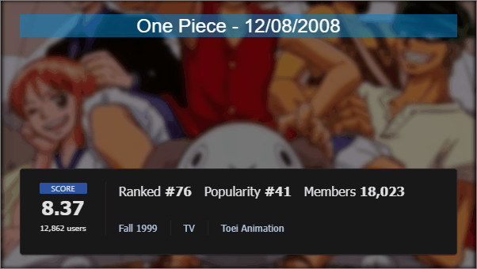
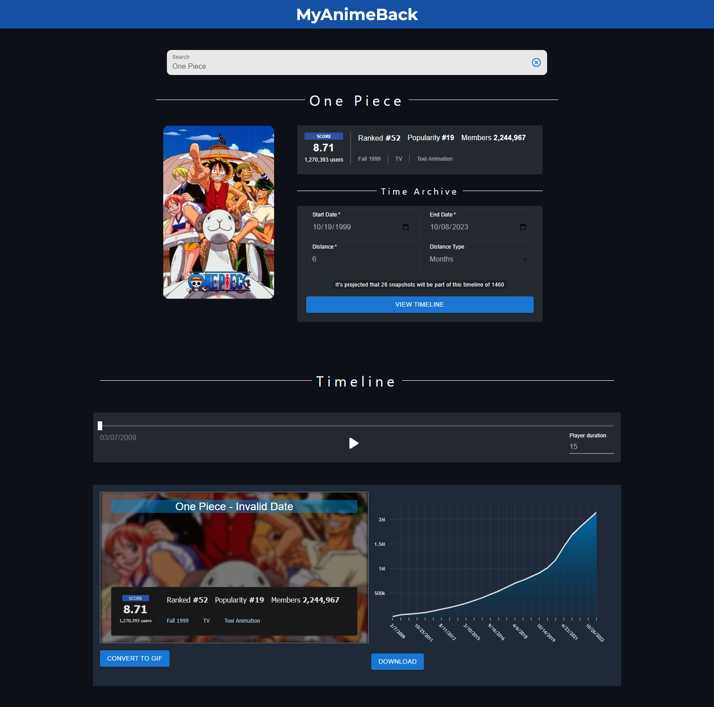

# MyAnimeBack

<div align="center">
  
  <br/>
  <b>One Piece Series Timeline 2008 - 2023</b>
</div>

---

## Overview

**MyAnimeBack** is a web scraping API developed to fetch historical data from MyAnimeList. This project is integrated with the Wayback Machine API and serves as the backend for another application. It provides an efficient approach to collect and analyze historical statistics for different anime and manga titles.

---

##  Features

- Retrieve snapshots of MyAnimeList pages at various timestamps with the Wayback Machine API.
- Scrape and interpret data using the Jsoup library.
- Extract historical stats like score, popularity, and favorites.
- Implement robust error and exception handling.

---


##  Frontend Screenshot

<div style="display: flex; align-items: center;">
  <div style="flex: 1;">
    
  </div>
  <div style="flex: 2; margin-left: 20px;">
    <h3>Screenshot Description</h3>
    <p>The screenshot showcases various elements of the frontend:</p>
    <ul>
      <li><strong>Search Bar:</strong> At the top, a search bar lets you input a MyAnimeList URL for an anime or manga, initiating an automatic search.</li>
      <li><strong>Information Form:</strong> Below the search bar, this form allows you to input specifics for extracting anime snapshots.</li>
      <li><strong>Timeline Slider:</strong> Positioned under the form, this slider enables navigation through different timestamps for your chosen anime.</li>
      <li><strong>Chart Display:</strong> On the right, a chart displays the anime's statistical trends over time.</li>
      <li><strong>GIF Preview:</strong> On the left, a GIF provides a visual overview of the anime.</li>
    </ul>
  </div>
</div>


##  Services

### WaybackMachineClient

This service interfaces with the Wayback Machine API to obtain historical snapshots of MyAnimeList pages. Exception handling is in place to ensure smooth operations.

### MyAnimeListScraper

A specialized web scraper for MyAnimeList, implementing the `ArchiveScraper` interface. It utilizes the Jsoup library to scrape and process data.

---

##  Workflow Diagram

\```mermaid
sequenceDiagram
    participant Client
    participant Controller
    participant WaybackMachineClient
    participant MyAnimeListScraper
    participant Jsoup

    Client->>Controller: Request anime/manga data
    Controller->>WaybackMachineClient: getSnapshotsByYear(url, year)
    WaybackMachineClient->>WaybackMachineClient: requestCalendarCaptures(endpoint)
    WaybackMachineClient-->>Controller: List<Snapshot>
    Controller->>MyAnimeListScraper: scrape(snapshot.url)
    MyAnimeListScraper->>Jsoup: connectToUrl(url)
    Jsoup-->>MyAnimeListScraper: Document
    MyAnimeListScraper->>MyAnimeListScraper: extractData(Document, target)
    MyAnimeListScraper-->>Controller: MediaState
    Controller-->>Client: Response with anime/manga data
\```

---

##  Acknowledgments

- [MyAnimeList](https://myanimelist.net) for the extensive anime and manga database.
- [The Wayback Machine](https://archive.org/web/) for archiving web pages.
- [Spring Boot](https://spring.io/projects/spring-boot) for easing Java application development.
- [Jsoup](https://jsoup.org/) for the web scraping library.

---

##  Future Goals

- Broaden the API's scope with more endpoints and features.
- Enhance error handling for a more robust application.

---

##  License

This project falls under the [MIT License](LICENSE). For more details, please refer to the [LICENSE](LICENSE) file.
