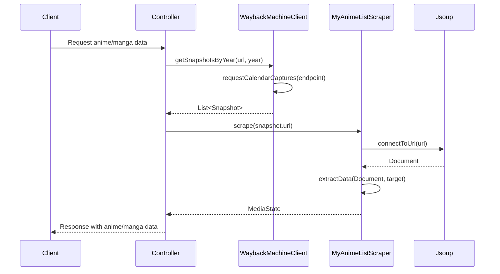

#MyAnimeBack

*Caption: One Piece Series Timeline 2008 - 2023*

## MyAnimeBack - MyAnimeList Historical Data API

MyAnimeBack is a web scraping API that retrieves historical data from MyAnimeList by leveraging the Wayback Machine API. The project serves as the backend for another application and aims to provide an easy way to gather and analyze historical statistics for various anime and manga titles.

## Features

-   Retrieve snapshots of MyAnimeList pages from different points in time using the Wayback Machine API.
-   Scrape and parse data from MyAnimeList pages using the Jsoup library.
-   Extract historical statistics such as score, popularity, and favorites for a given anime or manga title.
-   Handle various exceptions and errors during the data retrieval and scraping process.
-   Expose a RESTful API for easy integration with frontend applications.

## Services

### WaybackMachineClient

This service interacts with the Wayback Machine API (archive.org) to fetch snapshots of MyAnimeList pages at different points in time. It handles various exceptions that may occur during the process.

### MyAnimeListScraper

This service is a web scraper designed specifically for scraping data from MyAnimeList pages. It implements the `ArchiveScraper` interface and extracts relevant information from the pages using the Jsoup library.

## Diagram

This sequence diagram illustrates the flow of data and interactions between different components when a client requests anime or manga data. The process begins with the client sending a request to the controller. The controller then interacts with the WaybackMachineClient (renamed from RestTemplate to avoid confusion) to retrieve snapshots by year. The WaybackMachineClient retrieves calendar captures and returns a list of snapshots to the controller. The controller then uses the MyAnimeListScraper to scrape data from the snapshot. The scraper connects to the URL using Jsoup and extracts the necessary data from the returned document. Finally, the controller sends the requested data back to the client.

## Acknowledgments

- [MyAnimeList](https://myanimelist.net) for providing a comprehensive database of anime and manga titles.
- [The Wayback Machine](https://archive.org/web/) for making it possible to access historical snapshots of web pages.
- [Spring Boot](https://spring.io/projects/spring-boot) for simplifying the development of Java applications.
- [Jsoup](https://jsoup.org/) for providing an easy-to-use library for web scraping.

## Future Goals

- Expand the API to include additional endpoints and features that will allow users to fetch more detailed historical data for anime and manga titles.
- Improve error handling and exception management for a more robust and reliable application.

## License

This project is licensed under the [MIT License](LICENSE). Please see the [LICENSE](LICENSE) file for details.
